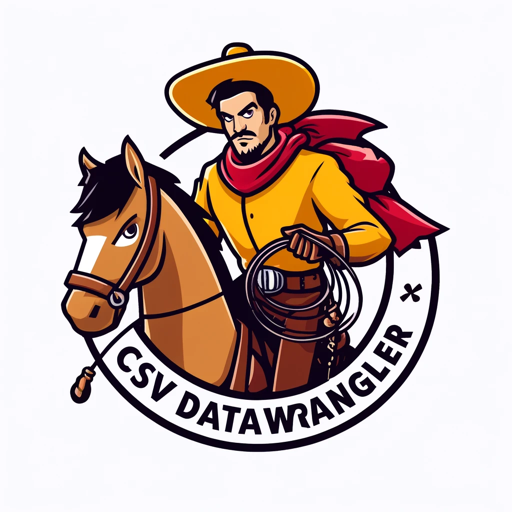
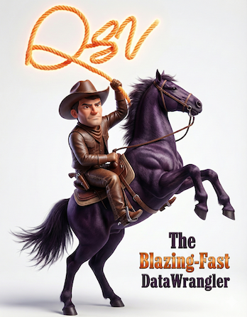
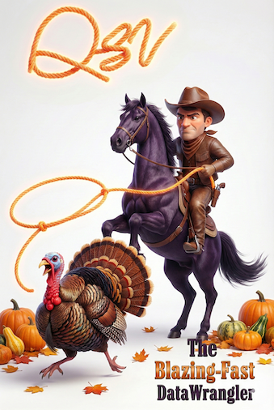
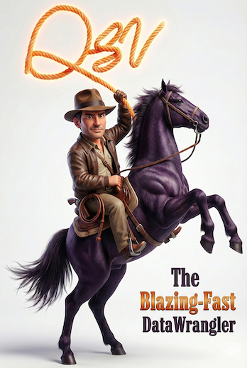
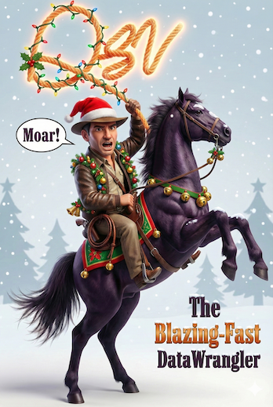
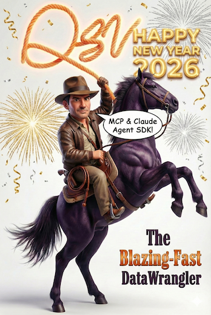
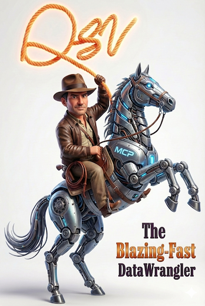

# EVENT LOGO ARCHIVE

After Google released [Nano Banana Pro on Nov 20, 2025](https://blog.google/technology/ai/nano-banana-pro/), I thought it was high time we modernized [qsv's intentionally kitschy logo](https://github.com/dathere/qsv/discussions/295) with AI.

I did so using the prompt - _Can you create a modern, semi photo-realistic version of this image (referring to the original logo), replacing "CSV DataWrangler" with just "The Blazing-Fast DataWrangler"?_

And it was [amazing](../qsv_logo-gemini-nano-banana.png)! Still kitschy, but not as "eye-hurting" ugly as my amateur illustration.

Given how easy it is - we'll now periodically change the logo to reflect current events/season/holiday, switching back to the base AI-reimagined logo afterwards.

We'll keep an archive of the generated images here along with the prompt used to generate them.

| Image | Date&nbsp;Range          | Prompt |
|-------|------------------------|--------|
|  | 2022-03-02 to 2025-11-24| ORIGINAL: intentionally kitschy logo that is a frankenstein mashup of several free resources. Created for qsv's public debut at NYC School of Data 2022. Details [here](https://github.com/dathere/qsv/commit/831890b4a55dda860e104fb17fab4be4784d38c2) |
|  | 2024-03 |  CSV,CONF,V8 2024: [Several event logos](./ckanconfv8-2024/) created with ChatGPT for csv,conf,v8 presentation in Puebla, Mexico |
|  | 2025-11-25 | NANO BANANA (BASE): Can you create a modern, semi photo-realistic version of this image (referring to ORIGINAL), replacing "CSV DataWrangler" with just "The Blazing-Fast DataWrangler"? |
|  | 2025-11-26 to 2025-11-30 | THANKSGIVING 2025: Can you give this image (referring to BASE) a Thanksgiving flavor while keeping the same dimensions? Perhaps, by having the Cowboy trying to lasso a turkey? |
|  | 2025-12-08 | QSV INDY: Can you give this image (BASE) an Indiana Jones vibe while keeping the same dimensions.  RATIONALE: As qsv takes on more FAIRification, AI and Metadata inferencing capabilities - he's not just a Data-Wrangling Cowboy, he's also a [Data Archeologist](https://en.wikipedia.org/wiki/Indiana_Jones_(character)#Character_description_and_formation) (AKA [Ontologist](https://medium.com/seek-blog/what-does-an-ontologist-do-c003f94cfd6d))! |
|  | 2025-12-24 to 2026-01-03 | HOLIDAY 2025: Can you give this image (referring to QSV INDY) a Christmas holiday flavor, with the Cowboy shouting "Moar!". Keep the same pose while keeping the same dimensions. |
|  | 2026-01-04 to 2026-01-11 | NEW YEAR 2026: Can you give the image (QSV INDY image) a Happy New Year 2026 flavor, with the Cowboy shouting "MCP & Claude Agent SDK!" Keep the same dimensions and make sure the QSV lasso is there and don't put a party hat on the Cowboy. |
|  | 2026-01-05 | MCP 2026: Can you make the horse robotic? Also, add an "MCP" label on the robotic horse. Keep the same pose and dimensions. |
